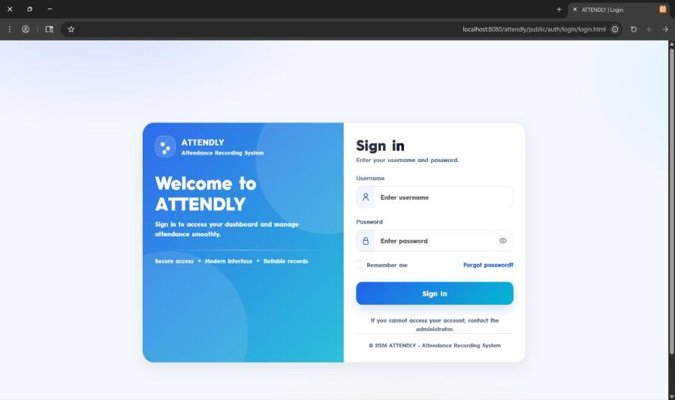
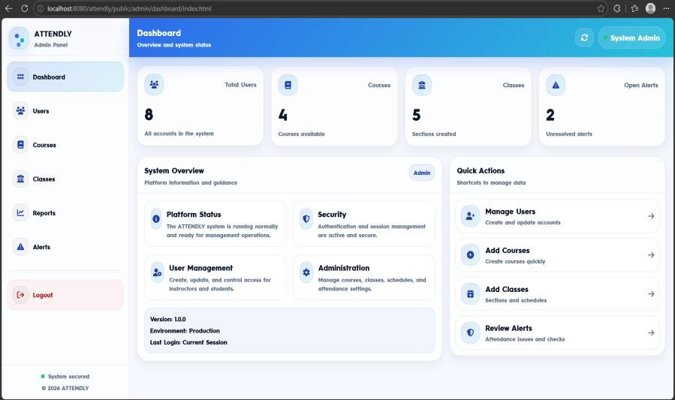
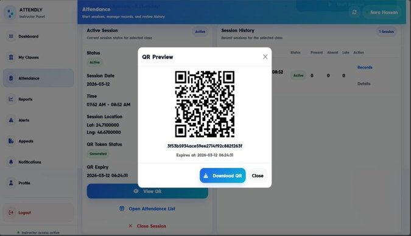

# 📋 ATTENDLY — Smart Attendance Recording System

> A graduation project for the Bachelor of Science in Information Systems  
> Northern Border University — Faculty of Computing and Information Technology, Rafha  
> Spring 2025/2026

---

## 🌟 Overview

**ATTENDLY** is a web-based smart attendance management system that replaces traditional paper-based methods with a secure, automated, and transparent solution. The system uses **QR code scanning** and **real-time location verification** to ensure students are physically present before recording attendance.

---

## ✨ Key Features

- 🔐 **Secure Authentication** — Role-based login for Admin, Instructor, and Student
- 📱 **QR Code Attendance** — Instructors generate unique QR codes per session; students scan to check in
- 📍 **Location Verification** — GPS-based geofencing ensures students are on campus
- 🟢🟡🔴 **Reliability Indicator** — Color-coded attendance classification (Green / Yellow / Red)
- 📊 **Reports & Analytics** — Exportable PDF attendance reports per course and class
- 🔔 **Notifications System** — Real-time alerts for attendance updates and warnings
- ⚖️ **Appeals Mechanism** — Students can dispute attendance records with supporting evidence
- 🛡️ **Anti-Fraud** — Prevents proxy attendance and duplicate submissions

---

## 🛠️ Tech Stack

| Layer | Technology |
|-------|-----------|
| Frontend | HTML, CSS, JavaScript |
| Backend | PHP |
| Database | MySQL |
| Web Server | Apache |
| Editor | VS Code |

---

## 👥 User Roles

### 🔧 Administrator
- Manage users (instructors & students)
- Create and assign courses and classes
- View system-wide attendance reports
- Monitor alerts and system activity

### 👨‍🏫 Instructor
- Start and manage attendance sessions
- Generate QR codes for each session
- Edit attendance records manually
- Review student appeals and alerts
- Export attendance reports as PDF

### 🎓 Student
- Scan QR code to submit attendance
- View attendance history with reliability details
- Submit appeals for disputed records
- Receive real-time notifications

---

## 🗄️ Database Structure

The system uses **10 relational tables**:

| Table | Description |
|-------|-------------|
| `users` | All system users (admin, instructor, student) |
| `courses` | Academic courses |
| `classes` | Class sections and schedules |
| `instructor_course` | Instructor-to-course assignments |
| `class_enrollment` | Student enrollment in classes |
| `attendance_sessions` | QR-based attendance sessions |
| `attendance_records` | Individual student attendance entries |
| `attendance_alerts` | Low attendance and suspicious behavior alerts |
| `notifications` | System notifications per user |
| `attendance_appeals` | Student attendance dispute submissions |

---

## 🚀 Getting Started

### Prerequisites
- PHP 7.4+
- MySQL 5.7+
- Apache (XAMPP / WAMP recommended)

### Installation

```bash
# 1. Clone the repository
git clone https://github.com/your-username/attendly.git

# 2. Move to your web server directory (e.g., htdocs for XAMPP)
cp -r attendly/ /xampp/htdocs/

# 3. Import the database
# Open phpMyAdmin → Create database "attendly" → Import attendly.sql

# 4. Configure database connection
cp config/db.example.php config/db.php
# Edit config/db.php with your database credentials

# 5. Start Apache and MySQL, then open:
# http://localhost/attendly/public/auth/login.html
```

---

## 📸 Screenshots

**Login Page**


**Admin Dashboard**


**QR Code Attendance**



---

## 🏗️ System Architecture

The system follows a **3-tier architecture**:
- **Presentation Layer** — HTML/CSS/JS frontend pages
- **Business Logic Layer** — PHP backend API endpoints
- **Data Layer** — MySQL relational database

---

## 👩‍💻 About This Project

ATTENDLY was developed as a **team graduation project** at Northern Border University. This repository represents my personal contribution — **Sarah Al-Anazi**.

**My Role:**
- Designed and implemented the student interface and instructor dashboard
- Built the QR code generation and scanning logic
- Developed the location verification and reliability classification system
- Implemented the appeals and notifications modules
- Structured and managed the MySQL database

---

## 📄 License

This project was developed as a graduation project for academic purposes at Northern Border University, 2026.
